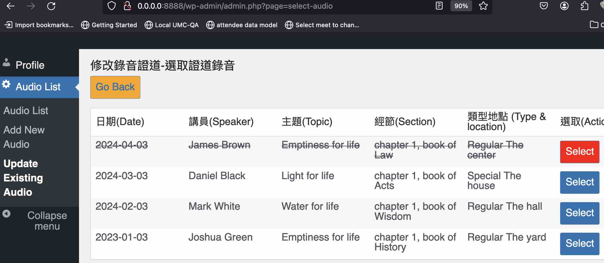
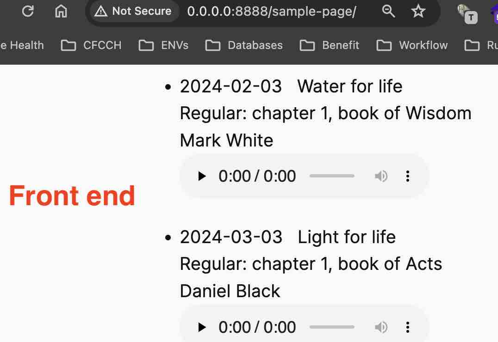

# Plugin Name
Contributors: Jack  
Link: https://xjlin0.github.io/  
Tags: audio, player  
Requires at least: 6.5  
Tested up to: 6.5.5  
Stable tag:  
License: Apache-2.0 license  
License URI: https://github.com/xjlin0/audio-list?tab=Apache-2.0-1-ov-file  

A Wordpress plug-in for showing HTML5 players for audio files in the remote folders, based on Dennis' code and https://wppb.me

## Description

It can display HTML5 players of all audios in the database. In Post or Pages, please insert short codes like this:
```js
[audio-list id='1'
            sermondate='2024%'
            type='regular'
            audio_style='width: 80%; min-width:100px'
            stripe_style='background-color: #E8E8E8;'
            url='https://host.server.com/org-name/path/2024/']
```
`sermondate%` (with the percent symbol at the end) and `type` are for filtering rows from `wp_audio_list` table in the Wordpress database.  It will be rendered as multiple players with the audio_style supplied.  With the CSS style from `audio_style`, the player will get the link from `url` prefix and the filename of `audiofile` from database. Optionally the row stripe CSS style can be added via `stripe_style`. If there are multiple audio-list short codes, please add `id=1`, `id=2`, etc so that the id of the each player can be unique. If there is only one audio-list short code, id is not required.

In the Wordpress Admin dashboard, Contributors will find side bar menu item "Audio List" where you can add meta data for each audio or select and update each audio.  The soft deleted audio won't be shown on the Wordpress frontend.

## Installation

1. Download the plugin as a [ZIP file](https://github.com/xjlin0/audio-list/archive/master.zip) from GitHub.
2. Install and Activate the plugin through the 'Plugins' and Upload menu in WordPress admin dashboard.
3. Optionally, restore the Mysql database table `wp_audio_list`.

## Streenshots



## Frequently Asked Questions

### Which PHP, Wordpress and MySQL versions are supported?

It's developed on PHP 8.2 and Wordpress 6.5.3~5 on MySQL 5.7, never tested in other versions.

## Changelog

### 1.0
* Initial implantation. No Bootstrap, no JQuery and No database password required.


## Upgrade Notice

### 1.0
There's database table name change from the previous draft code, please change SQL INSERT table name accordingly for database restore.

## local development using Wordpress in docker-compose and mysql in host

While [Wazoo's docker-compose](https://youtu.be/gEceSAJI_3s) is great for everything using docker-compose, here is yet another docker-compose.yml if you'd like to develop Wordpress plug-in in docker-compose with mysql in local rather than in docker.  Just `docker compose up` and you will see `html` folder shows up in the folder of `docker-compose.yml`:

```yaml
services:
  wordpress:
    extra_hosts:
      - host.docker.internal:host-gateway
    image: wordpress:6.5.3-apache
    restart: unless-stopped
    ports:
      - "8888:80"
    environment:
      WORDPRESS_DEBUG: 1
      WORDPRESS_DB_HOST: host.docker.internal:3306
      WORDPRESS_DB_USER: host_mysql_user_name
      WORDPRESS_DB_PASSWORD: 'host mysql password or empty string with quotes'
      WORDPRESS_DB_NAME: host_mysql_database_name
    volumes:
      - ./html:/var/www/html
    command: /bin/bash -c "apt-get update && apt-get install -y git && apache2-foreground"
```

Please also add the following lines in html/.htaccess to overcome PHP upload limit:
```
php_value upload_max_filesize 500M
php_value post_max_size 500M
```
Then after `docker compose up`, please browse http://0.0.0.0:8888 